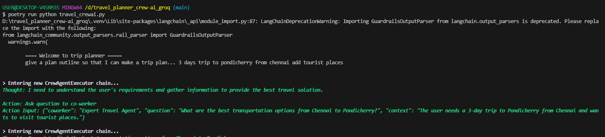
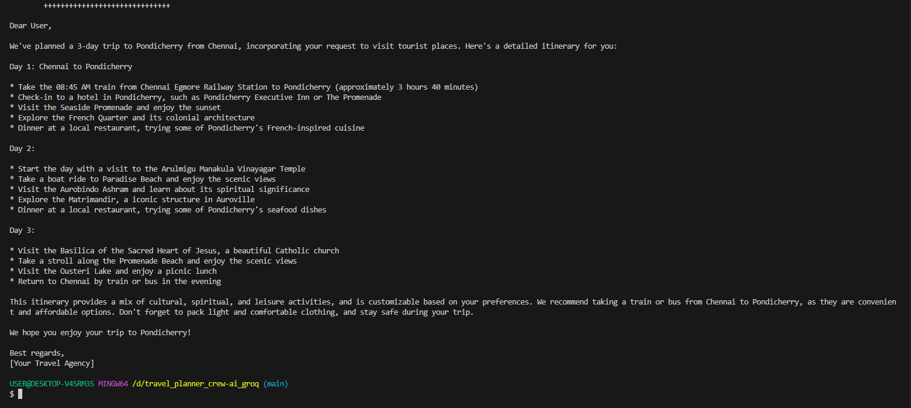

# Travel Planner Crew AI agent with Groq langchain

A Cli autonomous agent whose designed for creating travel itenaries as per the user needs.

## Screenshots

Running the Cli app


Final Output


## Installation

Install my-project with poetry, git clone this repo then cd to the folder.

```bash
  poetry install
```

### Environment Variables

To run this project, you will need to add the following environment variables to your .env file

`SERPER_API_KEY`

`SERPER_API_URL`

`GROQ_API_KEY`

`LLM` set this based on groq available models like ("llama3-70b-8192")

## Run the App

span into shell

```bash
  poetry shell
```

then run the program.

```bash
  poetry run python travel_crewai.py
```

#### Authors

- [@Amaithi Chirasan](https://www.github.com/amaithi-sam)
